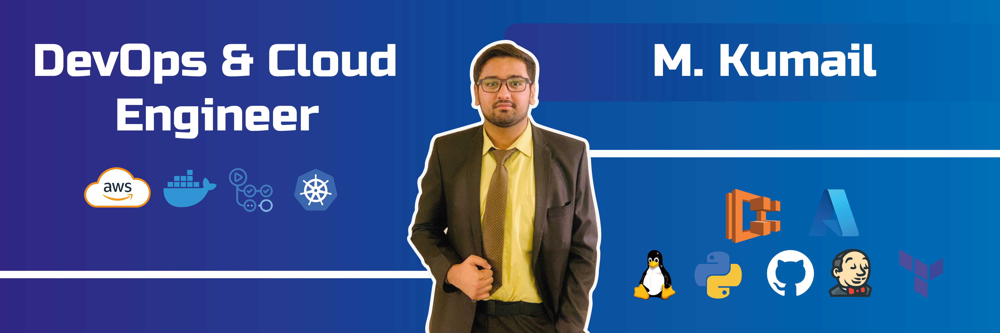

<h1 align="center">Hey! 👋, I'm Kumail</h1>

  

<h3 align="center">A Passionate DevOps Engineer From Pakistan</h3>

  <!-- spacing -->

  

- 🔭 I’m currently working on **DevOps**  
- 🌱 I’m currently learning **Kubernetes, Jenkins**  
- 📫 How to reach me: **mohammadkumail194@gmail.com**

  <!-- spacing -->

---

<h3 align="left">Connect with me:</h3>

  
  

---

<h3 align="left">Languages and Tools:</h3>

  <!-- 🚀 DevOps Tools -->
  

  

  

  

  

  

  

  

  <!-- 💻 Other Tools -->

  

  

  

  

  

  

  

  

  

  

  

  <!-- spacing -->

---

<!-- GitHub Stats -->

  

  

  

> *"Making DevOps simple with practical know-how. Building the future through automation, one pipeline at a time!"*
